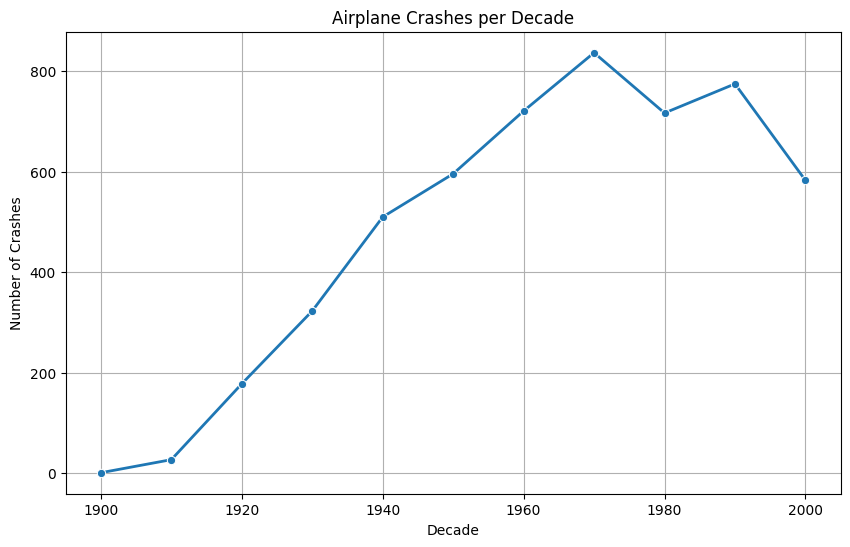
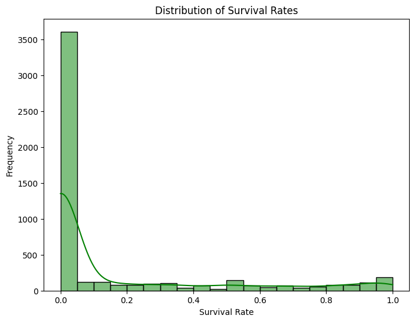
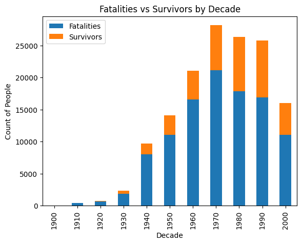
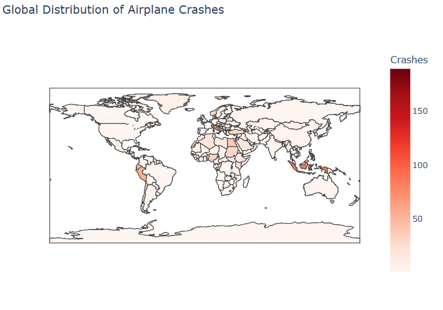
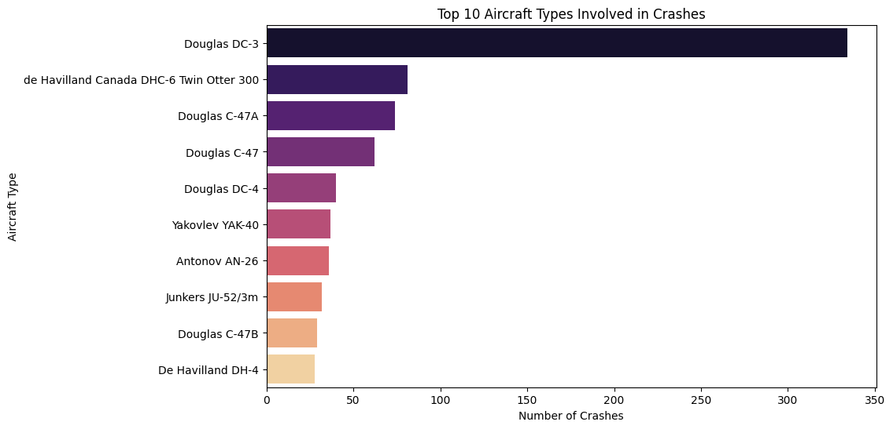
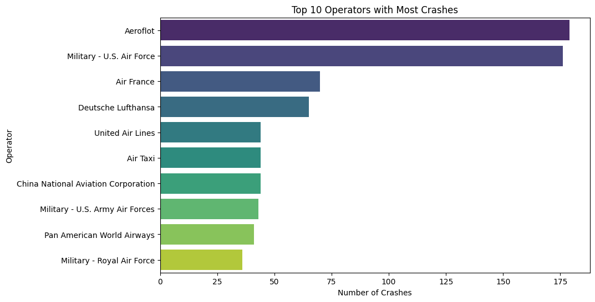

✈️ Air India Crash Data Analysis
📌 Project Overview

This project analyzes historical data related to Air India plane crashes and incidents.
The goal is to explore patterns, causes, and impacts of crashes through data cleaning, analysis, and visualization.

 Dataset Source

The dataset used in this project was taken from Kaggle:

🔗 Air India Plane Crash Dataset on Kaggle

 Libraries Used

Pandas → load & clean dataset (handle missing values, format dates).

NumPy → numerical analysis (averages, max/min fatalities).

Matplotlib → line/bar plots, saving graphs as .png.

Seaborn → heatmaps, pie charts, and styled visualizations.

Jupyter Notebook → step-by-step interactive analysis.

 Features

 Crash counts by year & decade
 Fatalities vs Survivors study
 Causes of crashes (technical failure, human error, weather)
 Visual insights with saved plots

## 📷 Visualizations

Airplane Crashes Per Decade:  

Distribution of Survival Rates:  

Fatalities vs Survivors Per Decade:  

Global Distribution of Crashes:  

Top 10 Aircraft Types Involved in Crashes:  

Top 10 Operators with Most Crashes:  

Project Structure
AirIndiaCrashAnalysis/
│-- data/               # Dataset (Kaggle CSV file)  
│-- notebooks/          # Jupyter Notebooks  
│-- plots/              # Saved graphs  
│-- README.md           # Documentation  
│-- requirements.txt    # Dependencies  

How to Run

Clone this repository

git clone https://github.com/yourusername/AirIndiaCrashAnalysis.git
cd AirIndiaCrashAnalysis

Install dependencies

pip install -r requirements.txt

Run Jupyter Notebook for analysis

jupyter notebook

| Decade | No. of Crashes | Avg. Fatalities | Major Cause       | Trend           |
| ------ | -------------- | --------------- | ----------------- | --------------- |
| 1960s  | High           | 200+            | Technical Failure | Peak            |
| 1970s  | High           | 180+            | Human + Technical | Sustained High  |
| 1980s  | High           | 160+            | Technical Failure | Still Dangerous |
| 1990s  | Moderate       | 120+            | Weather + Human   | Declining       |
| 2000s  | Low            | 80–100          | Technical Issues  | Safer           |
| 2010s+ | Very Low       | Few casualties  | Rare Incidents    | Safe Era        |

📌 Future Work

Apply Machine Learning to predict crash likelihood based on weather/aircraft data.

Build an interactive dashboard with Streamlit or Dash.

Compare Air India crashes with global airline crash data.

License

This project is open-source and available under the MIT License.

